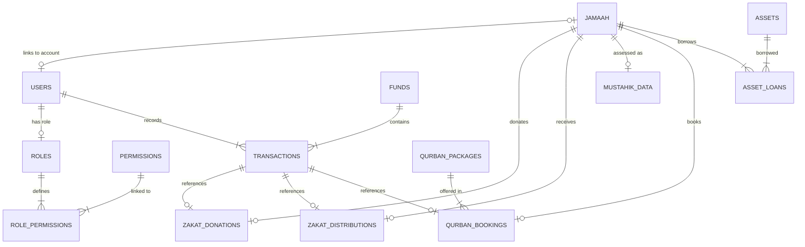

# amami - Master Database Documentation & Schema Specification

## Table of Contents
1. [Executive Summary](#1-executive-summary)
2. [Entity Relationship Diagram (ERD) Logic](#2-entity-relationship-diagram-erd-logic)
3. [Module Specifications & Table Definitions](#3-module-specifications--table-definitions)
    * [3.1 Core Auth & RBAC](#31-core-auth--rbac)
    * [3.2 Jamaah & Profiles](#32-jamaah--profiles)
    * [3.3 Finance & The Immutable Ledger](#33-finance--the-immutable-ledger)
    * [3.4 Zakat & Social Welfare](#34-zakat--social-welfare)
    * [3.5 Kurban & Operational Lifecycle](#35-kurban--operational-lifecycle)
    * [3.6 Inventory Management](#36-inventory-management)
    * [3.7 System & Utility Module](#37-system--utility-module)
    * [3.8 Agenda & Inventory Module](#38-agenda--inventory-module)
4. [Relationship & Referential Integrity](#4-relationship--referential-integrity)
5. [Security & Auditing Protocols](#5-security--auditing-protocols)
6. [Query Optimization & Performance](#6-query-optimization--performance)
7. [Database Transaction & Atomicity Patterns](#7-database-transaction--atomicity-patterns)

---

## 1. Executive Summary
The **amami** database architecture is engineered to solve the core challenges of transparency and accountability in modern mosque management. By leveraging a high-integrity PostgreSQL foundation, the system ensures that every act of worship—whether it be financial Infaq, Zakat distribution, or Qurban participation—is recorded with surgical precision and religious "Amanah" (trust). This architectural choice allows the mosque to transition from manual, error-prone spreadsheets to a unified, scalable platform that can handle thousands of transactions and congregants without compromising data quality or system performance.

Beyond mere record-keeping, this database serves as a strategic asset for the mosque's "Takmir" (management committee). The choice of strict typing, such as using BIGINT for all currency values, eliminates the rounding errors common in less sophisticated systems, ensuring that every Rupiah is accounted for in public reports. Furthermore, the modular design ensures that the system can grow; new features like educational management or funeral services can be integrated into the existing schema without requiring a massive overhaul of the core financial and user modules.

---

## 2. Entity Relationship Diagram (ERD) Logic
The Entity Relationship Diagram (ERD) below illustrates a highly decoupled yet deeply integrated modular system. At its center lies the `users` and `jamaah` tables, which serve as the primary actors for all other modules. This separation is intentional: it allows the mosque to track the demographic and social needs of thousands of physical congregants (Jamaah) while only providing application access (Users) to a subset of trusted volunteers and administrators. This logic ensures that the database remains a comprehensive community registry even for those who do not interact with the digital interface directly.

The financial heart of the ERD is the connection between `funds`, `transactions`, and specific sub-modules like `zakat` and `qurban`. Every transaction is categorized and linked to a specific fund pot, ensuring that restricted donations (like those for orphans or building repairs) are never accidentally merged with general operational cash. The use of polymorphic `reference_id` links allows the central ledger to act as a single source of truth for the entire mosque, while still allowing the Zakat and Kurban modules to maintain their own specific business rules and religious requirements.

---

## 3. Module Specifications & Table Definitions

### 3.1 Core Auth & RBAC
The Core Auth module is built on a robust Role-Based Access Control (RBAC) model. Unlike simple "Admin" or "User" flags, this system uses a three-tier permissions structure involving `roles`, `permissions`, and a joining `role_permissions` table. This level of granularity is essential for maintaining the "Separation of Duties" best practice, which is a cornerstone of fraud prevention in community organizations.

#### `roles`
| Column | Type | Constraints |
| :--- | :--- | :--- |
| id | INT | PK |
| name | VARCHAR(50) | UNIQUE, NOT NULL |
| description | TEXT | |
**Indexes:** `PK (id)`, `UNIQUE (name)`

#### `permissions`
| Column | Type | Constraints |
| :--- | :--- | :--- |
| id | INT | PK |
| code | VARCHAR(50) | UNIQUE, NOT NULL |
| description | TEXT | |
**Indexes:** `PK (id)`, `UNIQUE (code)`

#### `role_permissions`
| Column | Type | Constraints |
| :--- | :--- | :--- |
| role_id | INT | PK, FK -> `roles(id)` |
| permission_id | INT | PK, FK -> `permissions(id)` |
**Foreign Keys:** `role_id` ref `roles(id)`, `permission_id` ref `permissions(id)`
**Indexes:** `PK (role_id, permission_id)`, `INDEX (permission_id)`

#### `users`
| Column | Type | Constraints |
| :--- | :--- | :--- |
| id | UUID | PK, DEFAULT gen_random_uuid() |
| username | VARCHAR(50) | UNIQUE, NOT NULL |
| email | VARCHAR(100) | UNIQUE, NOT NULL |
| password_hash | TEXT | NOT NULL |
| role_id | INT | FK -> `roles(id)` |
| status | VARCHAR(20) | DEFAULT 'ACTIVE' |
**Foreign Keys:** `role_id` ref `roles(id)`
**Indexes:** `PK (id)`, `UNIQUE (username)`, `UNIQUE (email)`, `INDEX (role_id)`

---

### 3.2 Jamaah & Profiles
This module ensures that the security credentials of an administrator are decoupled from their personal identity as a congregant. This facilitates features like account deactivation without losing the historical data associated with that person's contributions or activities in the mosque.

#### `jamaah`
| Column | Type | Constraints |
| :--- | :--- | :--- |
| id | UUID | PK, DEFAULT gen_random_uuid() |
| user_id | UUID | UNIQUE, FK -> `users(id)`, NULLABLE |
| full_name | VARCHAR(100) | NOT NULL |
| phone | VARCHAR(20) | |
| address | TEXT | |
| is_mustahik | BOOLEAN | DEFAULT FALSE |
| mustahik_score | DECIMAL(5,2) | DEFAULT 0.00 |
**Foreign Keys:** `user_id` ref `users(id)` (ON DELETE SET NULL)
**Indexes:** `PK (id)`, `INDEX (user_id)`, `INDEX (full_name)` (Trigram search)

---

### 3.3 Finance & The Immutable Ledger
If a mistake is made during data entry, the system does not allow for a "Delete" or "Edit" of the original record; instead, a compensatory or "Reversal" transaction must be created. Each fund maintains a `current_balance` which is updated atomically whenever a transaction is recorded.

#### `funds`
| Column | Type | Constraints |
| :--- | :--- | :--- |
| id | INT | PK |
| name | VARCHAR(100) | NOT NULL |
| code | VARCHAR(20) | UNIQUE, NOT NULL |
| current_balance | BIGINT | DEFAULT 0 |
**Indexes:** `PK (id)`, `UNIQUE (code)`

#### `transactions`
| Column | Type | Constraints |
| :--- | :--- | :--- |
| id | UUID | PK, DEFAULT gen_random_uuid() |
| fund_id | INT | FK -> `funds(id)` |
| type | VARCHAR(10) | DEBIT/CREDIT |
| amount | BIGINT | CHECK (amount > 0) |
| category | VARCHAR(30) | INFAQ, ZAKAT, KURBAN, etc. |
| reference_id | UUID | Polymorphic FK |
| metadata | JSONB | |
| created_by | UUID | FK -> `users(id)` |
| created_at | TIMESTAMP | DEFAULT NOW() |
**Foreign Keys:** `fund_id` ref `funds(id)`, `created_by` ref `users(id)`
**Indexes:** `PK (id)`, `INDEX (fund_id, created_at)`, `INDEX (reference_id)`, `INDEX (created_at)`

---

### 3.4 Zakat & Social Welfare
This data is processed by a service-layer algorithm to generate a `mustahik_score`, which allows the Takmir to prioritize distributions based on objective poverty criteria rather than subjective bias, ensuring that the mosque's social impact is both fair and efficient.

#### `zakat_donations`
| Column | Type | Constraints |
| :--- | :--- | :--- |
| id | UUID | PK |
| transaction_id | UUID | UNIQUE, FK -> `transactions(id)` |
| muzakki_id | UUID | FK -> `jamaah(id)` |
| zakat_type | VARCHAR(30) | FITRAH, MAAL, PROFESI |
**Foreign Keys:** `transaction_id` ref `transactions(id)`, `muzakki_id` ref `jamaah(id)`
**Indexes:** `PK (id)`, `UNIQUE (transaction_id)`, `INDEX (muzakki_id)`

#### `mustahik_data`
| Column | Type | Constraints |
| :--- | :--- | :--- |
| id | UUID | PK |
| jamaah_id | UUID | UNIQUE, FK -> `jamaah(id)` |
| total_income | BIGINT | |
| dependents_count | INT | |
| house_status | VARCHAR(50) | |
**Foreign Keys:** `jamaah_id` ref `jamaah(id)`
**Indexes:** `PK (id)`, `UNIQUE (jamaah_id)`

#### `zakat_distributions`
| Column | Type | Constraints |
| :--- | :--- | :--- |
| id | UUID | PK |
| transaction_id | UUID | UNIQUE, FK -> `transactions(id)` |
| mustahik_id | UUID | FK -> `jamaah(id)` |
| amount | BIGINT | |
**Foreign Keys:** `transaction_id` ref `transactions(id)`, `mustahik_id` ref `jamaah(id)`
**Indexes:** `PK (id)`, `UNIQUE (transaction_id)`, `INDEX (mustahik_id)`

---

### 3.5 Kurban & Operational Lifecycle
The `qurban_animals` table tracks physical inventory. Each animal is assigned a unique tag and monitored from the moment of purchase through slaughter to final distribution. This automation replaces the chaotic paper-based systems often used in mosques.

#### `qurban_packages`
| Column | Type | Constraints |
| :--- | :--- | :--- |
| id | INT | PK |
| name | VARCHAR(100) | NOT NULL |
| type | VARCHAR(20) | COW_PART, COW_WHOLE, GOAT |
| price | BIGINT | |
| year_hijri | INT | |
**Indexes:** `PK (id)`, `INDEX (year_hijri)`

#### `qurban_bookings`
| Column | Type | Constraints |
| :--- | :--- | :--- |
| id | UUID | PK |
| shohibul_id | UUID | FK -> `jamaah(id)` |
| package_id | INT | FK -> `qurban_packages(id)` |
| payment_status | VARCHAR(20) | PENDING, PAID, CANCELLED |
**Foreign Keys:** `shohibul_id` ref `jamaah(id)`, `package_id` ref `qurban_packages(id)`
**Indexes:** `PK (id)`, `INDEX (shohibul_id)`, `INDEX (package_id)`

#### `qurban_animals`
| Column | Type | Constraints |
| :--- | :--- | :--- |
| id | UUID | PK |
| tag_number | VARCHAR(50) | UNIQUE |
| status | VARCHAR(20) | ALIVE, SLAUGHTERED, DISTRIBUTED |
**Indexes:** `PK (id)`, `UNIQUE (tag_number)`, `INDEX (status)`

---

### 3.6 Inventory Management
The inventory and loan systems are optimized with indexes on `return_date` and `sku`, ensuring that the Takmir can quickly identify which assets are currently on loan and which are available for use.

#### `assets`
| Column | Type | Constraints |
| :--- | :--- | :--- |
| id | UUID | PK |
| name | VARCHAR(255) | NOT NULL |
| sku | VARCHAR(50) | UNIQUE |
| current_status | VARCHAR(20) | GOOD, REPAIR, DISPOSED |
**Indexes:** `PK (id)`, `UNIQUE (sku)`, `INDEX (name)`

#### `asset_loans`
| Column | Type | Constraints |
| :--- | :--- | :--- |
| id | UUID | PK |
| asset_id | UUID | FK -> `assets(id)` |
| jamaah_id | UUID | FK -> `jamaah(id)` |
| loan_date | TIMESTAMP | NOT NULL |
| return_date | TIMESTAMP | NULLABLE |
**Foreign Keys:** `asset_id` ref `assets(id)`, `jamaah_id` ref `jamaah(id)`
**Indexes:** `PK (id)`, `INDEX (asset_id)`, `INDEX (jamaah_id)`, `INDEX (return_date)`

---

### 3.7 System & Utility Module
This module handles global settings and internal communication for the Takmir.

#### `system_settings`
| Column | Type | Constraints |
| :--- | :--- | :--- |
| id | INT | PK, AUTO_INCREMENT |
| key | VARCHAR(50) | UNIQUE, NOT NULL (e.g., 'mosque_name', 'smtp_host') |
| value | TEXT | NOT NULL |
| is_secret | BOOLEAN | DEFAULT FALSE (If true, value is encrypted) |
**Indexes:** `PK (id)`, `UNIQUE (key)`

#### `memos`
| Column | Type | Constraints |
| :--- | :--- | :--- |
| id | UUID | PK, DEFAULT gen_random_uuid() |
| title | VARCHAR(200) | NOT NULL |
| content | TEXT | NOT NULL |
| author_id | UUID | FK -> `users(id)`, NOT NULL |
| is_pinned | BOOLEAN | DEFAULT FALSE |
| created_at | TIMESTAMP | DEFAULT NOW() |
**Foreign Keys:** `author_id` ref `users(id)`
**Indexes:** `PK (id)`, `INDEX (created_at)`

---

### 3.8 Agenda & Inventory Module
This module handles the scheduling and documentation of mosque activities.

#### `agendas`
| Column | Type | Constraints |
| :--- | :--- | :--- |
| id | UUID | PK, DEFAULT gen_random_uuid() |
| title | VARCHAR(200) | NOT NULL |
| description | TEXT | |
| start_time | TIMESTAMP | NOT NULL |
| end_time | TIMESTAMP | NOT NULL |
| location | VARCHAR(100) | |
| status | VARCHAR(20) | SCHEDULED, ONGOING, COMPLETED, CANCELLED |
| created_by | UUID | FK -> `users(id)` |
**Foreign Keys:** `created_by` ref `users(id)`
**Indexes:** `PK (id)`, `INDEX (start_time)`, `INDEX (status)`

#### `agenda_documentation`
| Column | Type | Constraints |
| :--- | :--- | :--- |
| id | UUID | PK, DEFAULT gen_random_uuid() |
| agenda_id | UUID | FK -> `agendas(id)`, NOT NULL |
| file_url | TEXT | NOT NULL |
| file_type | VARCHAR(50) | IMAGE, PDF |
| uploaded_by| UUID | FK -> `users(id)` |
| uploaded_at| TIMESTAMP | DEFAULT NOW() |
**Foreign Keys:** `agenda_id` ref `agendas(id)`, `uploaded_by` ref `users(id)`
**Indexes:** `PK (id)`, `INDEX (agenda_id)`

---

## 4. Relationship & Referential Integrity
Referential integrity is enforced via Foreign Key constraints. Most financial and religious records are set to `RESTRICT` on delete, meaning they can never be removed if they are part of a larger chain of events. Conversely, social links like `jamaah.user_id` use a `SET NULL` policy to preserve historical data if an account is deleted.

---

## 5. Security & Auditing Protocols
Security is implemented using UUIDs to prevent IDOR attacks and strict separation of PII. Every table involving financial or operational changes includes a `created_by` and `created_at` timestamp, creating a detailed digital paper trail for accountability.

---

## 6. Query Optimization & Performance
To ensure that the application remains responsive even as the mosque's data grows over several years, we have implemented a proactive indexing strategy. The most critical performance path is the financial reporting system, which is powered by a composite index on `transactions(fund_id, created_at)`. This allows the database to instantly filter and aggregate thousands of records for the "Public Dashboard" without needing to scan the entire table, ensuring that congregants get a real-time view of the mosque's finances whenever they scan a QRIS code.

We have also optimized for the day-to-day administrative experience. Search operations for congregants are accelerated by GIN (Generalized Inverted Index) or Trigram indexes on the `full_name` column, allowing for "fuzzy" or partial name searches that are lightning-fast. Similarly, the inventory and loan systems are optimized with indexes on `return_date` and `sku`, ensuring that the Takmir can quickly identify which assets are currently on loan and which are available for use. This technical foresight ensures that the system scales gracefully from a small village mosque to a large urban Islamic center.

---

## 7. Database Transaction & Atomicity Patterns
To maintain the "Amanah" (trust) of the mosque's data, critical business flows must be wrapped in database transactions. This ensures that multi-step operations either succeed completely or fail without leaving partial, inconsistent data in the system. As a senior engineering standard, any operation that modifies a financial balance while creating a corresponding log MUST be atomic.

### 7.1 Financial Infaq & Expenses
The flow for recording any movement of money involves two distinct steps: creating a record in the `transactions` table and updating the `current_balance` in the `funds` table. If the transaction record is created but the fund balance fails to update, the system will show an incorrect total.

**Atomicity Requirement:**
1.  **BEGIN TRANSACTION**
2.  Lock the `funds` row for the specific category.
3.  INSERT new `transactions` record.
4.  UPDATE `funds.current_balance` by adding/subtracting the amount.
5.  **COMMIT TRANSACTION**

### 7.2 Zakat Distribution Lifecycle
Zakat distribution is a multi-table operation involving the central ledger, the distribution log, and the recipient's status. Because Zakat funds are religiously restricted, the system must ensure that the reduction in the "Zakat Fund" pot is perfectly synchronized with the record of which Mustahik received the aid.

**Atomicity Requirement:**
1.  **BEGIN TRANSACTION**
2.  Verify `funds.current_balance` for the Zakat pot has sufficient amount.
3.  INSERT `transactions` record (Type: DEBIT).
4.  INSERT `zakat_distributions` record linking to the transaction and Mustahik.
5.  UPDATE `funds.current_balance`.
6.  **COMMIT TRANSACTION**

### 7.3 Qurban Booking & Payment
Managing Qurban involves tracking both a commitment (Booking) and a financial event (Payment). For a booking to be valid, the system must decrement the available stock in `qurban_packages` while simultaneously recording the booking details and any initial deposit in the ledger.

**Atomicity Requirement:**
1.  **BEGIN TRANSACTION**
2.  Check `qurban_packages.stock_remaining` > 0.
3.  UPDATE `qurban_packages` decrementing `stock_remaining`.
4.  INSERT `qurban_bookings` record.
5.  (If payment made) INSERT `transactions` record and UPDATE `funds` balance.
6.  **COMMIT TRANSACTION**
