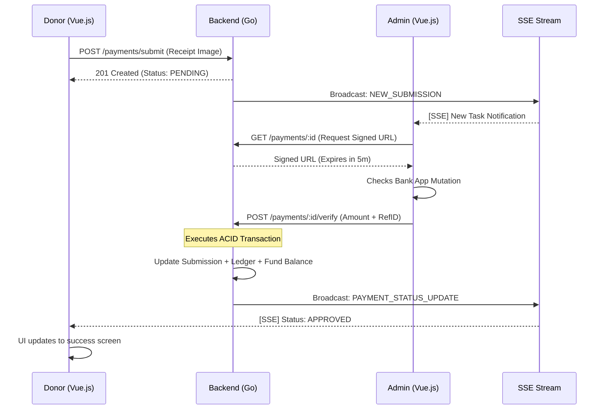
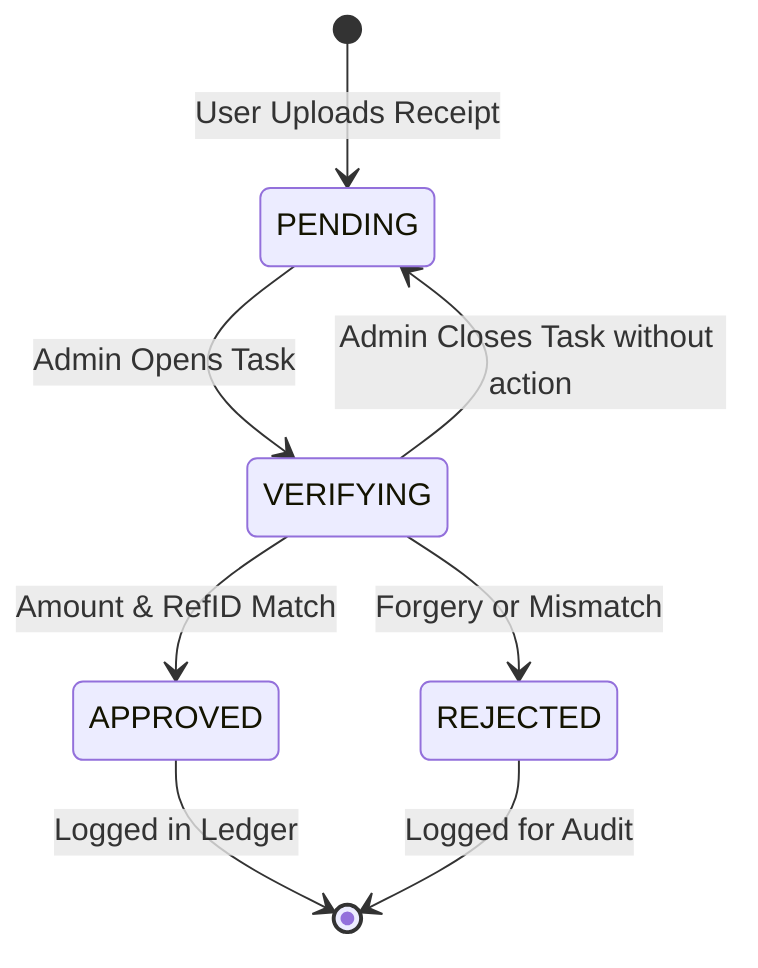

# amami - Payment System Architecture

## Table of Contents
1. [Overview](#1-overview)
2. [Payment Flow Diagrams](#2-payment-flow-diagrams)
3. [The Hybrid-Manual Lifecycle](#3-the-hybrid-manual-lifecycle)
4. [Security & Anti-Fraud Protocols](#4-security--anti-fraud-protocols)
5. [Technical Architecture: Server-Sent Events (SSE)](#5-technical-architecture-server-sent-events-sse)
6. [Resiliency & Connection Recovery](#6-resiliency--connection-recovery)
7. [Implementation Roadmap](#7-implementation-roadmap)

---

## 1. Overview
The **amami** payment system is designed to provide a modern, real-time experience while navigating the pragmatic constraints of mosque administration. It utilizes a **Hybrid-Manual Flow** that bridges the gap between traditional Static QRIS stickers and a fully automated fintech experience. 

This architecture prioritizes **Amanah** (data integrity and trust) by combining human verification with cryptographic and database-level safety nets.

---

## 2. Payment Flow Diagrams

### Sequence Diagram: Real-Time Verification Lifecycle
This diagram illustrates the high-concurrency interaction between the Donor, the Admin, and the Go Backend using SSE for instantaneous feedback.

### State Diagram: Submission Lifecycle
The following states ensure that no payment is lost and that every approval has a corresponding cryptographic audit trail.

---

## 3. The Hybrid-Manual Lifecycle

### 3.1 Stage 1: Donor Submission
The process begins on the Vue.js frontend, where the donor selects their intended contribution. 

1.  **Intent Selection**: User chooses the fund category (e.g., *Infaq Yatim*) and amount.
2.  **Payment Display**: The app displays the mosque's **Static QRIS**. This is a permanent QR code issued by the bank or a provider like LinkAja/Gopay.
3.  **Third-Party Transfer**: The user performs the payment outside our app using their preferred banking or e-wallet application.
4.  **Proof of Payment**: The user returns to the **amami** app and uploads a screenshot of the bank/e-wallet receipt. 
5.  **Persistence**: A record is created in the `payment_submissions` table with `status: 'PENDING'`.

### 3.2 Stage 2: Real-Time Admin Notification
To prevent delays, the system must act "alive."

1.  **Event Broadcast**: The Go backend detects the new database record and sends a signal to the `NotificationBroadcaster`.
2.  **SSE Delivery**: The signal is pushed via a **Server-Sent Events (SSE)** stream to all logged-in Admins.
3.  **Reactive UI**: The Admin's dashboard instantly updates with a toast notification and a badge on the "Pending Verifications" tab.

### 3.3 Stage 3: Verification & Approval
This is the "Human-in-the-loop" phase where security is paramount.

1.  **Bank Mutation Check**: The Takmir (Admin) opens their official Bank or QRIS merchant app to confirm the money has actually arrived.
2.  **Blind Verification Entry**: The Admin enters the **Actual Amount** and the **Bank Reference ID** (Unique ID from the bank receipt) into the **amami** dashboard.
3.  **Atomic Approval**: Upon clicking "Approve," the backend executes a database transaction:
    *   Updates `payment_submissions.status` to `APPROVED`.
    *   Creates a permanent, immutable record in the `transactions` ledger.
    *   Updates the specific `funds.current_balance`.
    *   Logs the `admin_id` who performed the verification.

### 3.4 Stage 4: Donor Confirmation
1.  **Success Push**: The backend pushes a `status_update` event via SSE specifically to the donor's open session.
2.  **Instant Feedback**: The donor's screen changes from "Processing" to a success state without a page refresh.

---

## 4. Security & Anti-Fraud Protocols

### 4.1 Anti-Double Spending (Unique Reference ID)
One of the primary risks in a manual payment flow is "Double Spending," where a malicious user (or an accidental one) uploads the same bank receipt image multiple times to claim multiple donations. This could lead to the mosque reporting inflated balances that do not exist in reality, damaging public trust and complicating financial audits.

To prevent this, we enforce a strict **Unique Constraint** on the `bank_reference_id` field within the `transactions` table. This ID is the globally unique identifier provided by the banking or e-wallet network (e.g., the RRN or Ref Number on a QRIS receipt). By requiring the Admin to enter this ID during verification, the database engine itself acts as the final gatekeeper; if any attempt is made to reuse an ID, the system will reject the transaction, ensuring the integrity of the mosque's financial records.

### 4.2 The Blind Verification Pattern
In many systems, admins tend to fall into "Auto-Pilot" mode, clicking "Approve" based on the user's claimed amount without actually cross-referencing with their bank mutation. This human error is the most common cause of financial discrepancies. If a user claims they sent Rp 1,000,000 but only sent Rp 100,000, a lazy approval could lead to significant missing funds.

The **Blind Verification Pattern** mitigates this by hiding the user's "Claimed Amount" from the Admin during the approval phase. The Admin must look at their bank app and manually type the amount that actually arrived. The Go backend then performs a match check; if the amounts do not match, the system prevents the approval and triggers a "High-Level Review" flag. This forces the Admin to be diligent, transforming the verification from a simple "Yes/No" into a factual data-entry task.

### 4.3 Temporal Image Privacy (Signed URLs)
Bank receipts and e-wallet screenshots are pieces of **Personal Identifiable Information (PII)**. They often contain the donor's full name, partial bank account numbers, and transaction timestamps. Exposing these images via public URLs would be a significant privacy violation and could lead to "Receipt Harvesting" by malicious actors.

Our architecture protects this data by storing all uploaded images in an **Encapsulated Storage** layer (private directory or secure bucket). These files are never accessible via public paths. Instead, when an authorized Admin needs to verify a payment, the backend generates a **Temporal Signed URL**. This URL is cryptographically signed and expires after 5 minutes. This ensures that even if a link is leaked, it becomes useless almost immediately, and only authenticated users can ever request a link to view the sensitive data.

### 4.4 Administrative Accountability & Audit Logs
In a community-managed organization like a mosque, internal trust is as important as external security. We must protect the system against potential internal misuse or simple administrative negligence. If money goes missing, the system must be able to identify exactly where the protocol broke down.

To achieve this, every approval is digitally "signed" by the system with the `User.ID` of the Admin who performed it. We do not just record *that* a payment was approved, but *who* looked at the bank mutation and took responsibility for it. This creates an exhaustive **Audit Trail** that can be reviewed during monthly committee meetings. Knowing that every action is logged creates a psychological deterrent against negligence and provides a clear path for resolving financial disputes.

---

## 5. Technical Architecture: Server-Sent Events (SSE)

### 5.1 Why SSE?
- **Native Reconnection**: Browsers automatically reconnect if the connection drops.
- **Efficiency**: Lower CPU and memory overhead compared to WebSockets for one-way streams.
- **Simplicity**: Operates over standard HTTP (port 80/443).

### 5.2 Stream Contract
The SSE stream sends lightweight JSON "Signals" to maintain security and performance.

| Event Type | Data Payload | Target |
| :--- | :--- | :--- |
| `NEW_SUBMISSION` | `{"id": "uuid"}` | Admin Role |
| `PAYMENT_STATUS` | `{"id": "uuid", "status": "APPROVED"}` | Specific User Session |
| `BALANCE_UPDATE` | `{"fund_id": 1, "new_total": 500000}` | Public/Global |

---

## 6. Resiliency & Connection Recovery
In a mobile-first environment, network instability is a certainty. The **amami** architecture is designed to be "Connection Agnostic," ensuring that donors and admins never miss a critical update due to a temporary signal drop.

### 6.1 Native SSE Reconnection
Unlike WebSockets, which require custom "heartbeat" and "reconnect" logic in JavaScript, SSE is natively managed by the browser's network stack.
*   **Auto-Retry**: If the HTTP stream is interrupted, the browser will automatically attempt to reconnect to the Go backend after a short delay (configurable via the `retry:` field in the SSE stream).
*   **Stateful Recovery**: Upon reconnection, the browser sends the `Last-Event-ID` header. This allows the Go backend to identify where the client left off and ensures no notifications are lost during the transition between Wi-Fi and Cellular data.

### 6.2 The "Signal + Fetch" Pattern (Defensive UI)
To ensure 100% data accuracy, we do not treat the SSE stream as a primary data carrier. Instead, we use it as a **Reactive Trigger**.
1.  **The Signal**: The backend pushes a minimal event: `{"type": "REFRESH_PAYMENT", "id": "uuid"}`.
2.  **The Action**: The Vue.js frontend receives this signal and performs a standard, authenticated **REST API call** to fetch the full object from the database.
3.  **The Fallback**: If the SSE connection remains broken for an extended period, the frontend Pinia store implements a "Stale-While-Revalidate" check whenever the app returns to the foreground, ensuring the UI always reflects the database state regardless of the stream's health.

### 6.3 Heartbeat & Ghost Connection Management
To prevent firewalls and proxies (like Nginx) from silently closing idle connections, the Go backend implements a **15-second Heartbeat**. The server sends a comment line (`: heartbeat`) every 15 seconds. This keeps the TCP socket active and allows the backend to quickly detect "Ghost Connections" (clients who have disconnected without sending a FIN packet), freeing up server resources immediately.

---

## 7. Implementation Roadmap
1.  **Phase 1**: Implement `PaymentSubmission` GORM model and `POST /api/v1/payments/submit` endpoint.
2.  **Phase 2**: Create the `Broadcaster` service in Go using channels.
3.  **Phase 3**: Build the SSE `/api/v1/stream` endpoint with heartbeat logic.
4.  **Phase 4**: Implement the `VerifyPayment` service logic with ACID transactions.
